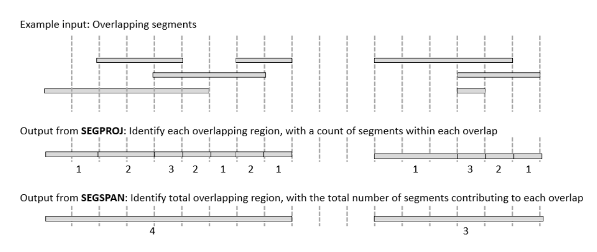

.. raw:: html

   Used in: gor only

.. _SEGSPAN:

=======
SEGSPAN
=======
The **SEGSPAN** command turns a stream of segments into a stream of non-overlapping segments. The input must minimally contain the three columns necessary to denote segment, i.e. Chrom, bpStart and bpStop.  The output is Chrom, bpStart, bpStop, and segCount where segCount is the number of segments in the input overlapping with the one in the output.

If the -gc option is not used, maxseg is infinite unless it is explicitly set to reduce the maximum output segment size. When the -gc option is in use, maxseg must be specified to override the default of 4Mb.  Larger maxseg may cause greater memory utilization.  Very small maxseg may cause very large output and thus, slow execution.

   Overlapping Variants module in the Sequence Miner

Usage
=====

.. code-block:: gor

	gor ... | segspan [-maxseg size] [-gc cols]

Options
=======

+------------------+---------------------------------------------------------------------------------------------------+
| ``-maxseg size`` | The maximum span of the segments in the input stream.  Defaults to 4000000 (4Mb) with -gc option. |
|                  | This parameter can be used to ensure that the output segments are not too large.                  |
+------------------+---------------------------------------------------------------------------------------------------+
| ``-gc cols``     | Group columns, i.e. the span segment is calculated separately for each group.                     |
+------------------+---------------------------------------------------------------------------------------------------+

Examples
========

.. code-block:: gor

    gor #exons# | segspan -gc gene_symbol -maxseg 3000000

The above command returns segments representing overlaping exons and the corresponding segment count from the same gene_symbol.

The :ref:`SEGSPAN` command used to be called SPAN.  SPAN has been deprecated.
