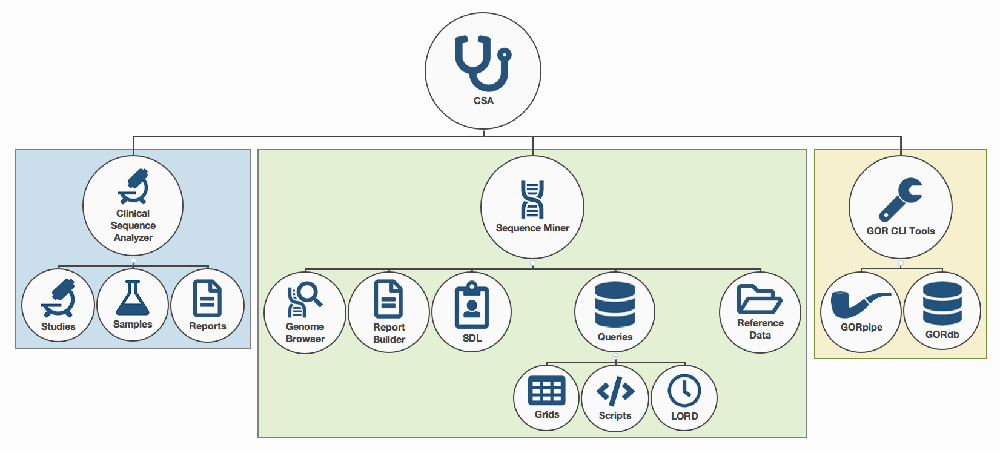

.. _index:

==================
GOR Query Language
==================

This manual is a comprehensive guide to the GOR Query Language, which is used to perform powerful data mining with your genomic data. The GOR Query Language is an essential tool that supports all of the various parts of the CSA product suite shown in the diagram below.

   The GOR Query Language is used in each of the components of CSA

This manual is organized in two separate ways. The chapters can be read from end to end as a walkthrough of the GOR Query Language, with plenty of examples of each.  The walkthrough is organized in such a way as to introduce the more basic concepts first. We will then work our way up to the more complicated commands that are possible with GOR queries.

Alternatively, you can use this manual as a reference. :ref:`Each command in GOR has its own page<quickReference>` with examples and a comprehensive list of functions with a description of their usage can also be found here. This manual assumes that you have some background in using databases and a working knowledge of writing SQL queries is certainly an asset when working in with GOR queries.

As you will soon learn, the GOR query language is based on a combination of features from relational database query languages like SQL and Unix shell commands. However, it is designed specifically to be used with genomic ordered data.

This manual covers a range of topics related to the usage of the GOR query language both in the Sequence Miner and on the command line with GorPipe. The :ref:`Quick Reference<quickReference>` contains a comprehensive list of GOR commands with all of the attributes that can be used with each.

.. toctree::
   :maxdepth: 1
   :hidden:

   ref_commands
   ref_functions
   introduction
   basicGORqueries
   filteringStreams
   columnModifications
   groupingAndAggregation
   nestedStreams
   joiningTables
   mapMultimap
   pivoting
   sequenceReads
   variantData
   materializedViews
   parallelGOR
   glossary

